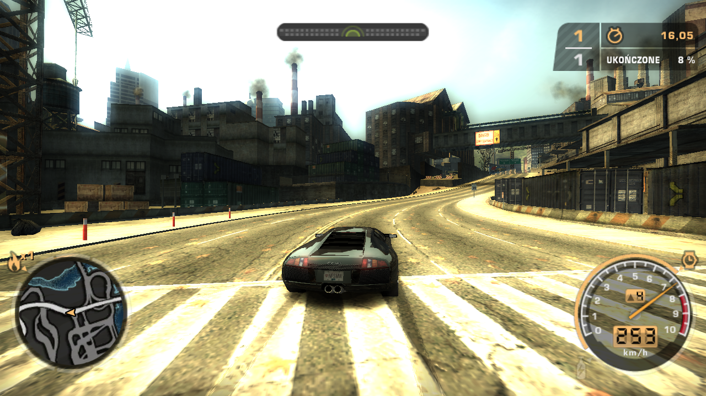
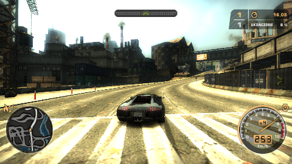
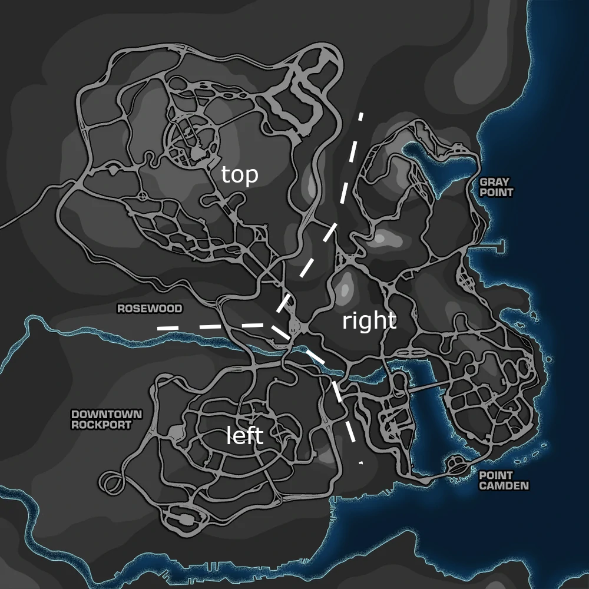

# Need for Speed Most Wanted 2005 self-driving car

   

A project in which ideas, improvements and fixes will never come to an end. The goal was to train a neural network to play the game Need for Speed Most Wanted. Below you can see it in action.

## Key points
* A model was trained using the fast.ai library, which is built on top of PyTorch.
* The model takes as an input current game frame and speed. It outputs desired changes in speed and orientation as well as the probabilities of WSAD key presses that can be used to control the car directly. 
* A dataset consists of about 150k images - roughly 75% of them were captured by myself playing the game, while the rest by an in-game bot (that in a normal setting acts as our rivals on the track).
* A steering loop is based on the car's orientation difference between frames that is read indirectly from the minimap and current speed, read directly from the screen.

## Technical details
*Note: The word "model" refers to a neural network or the entire system that controls the behaviour of the car (which uses a neural net), depending on the context.*

### 1. Building the dataset
The game runs at 1280 x 720p. During the race a script continuously captures frames, then extracts from them car's current speed and orientation using OpenCV. The former is visible at the 3-digit 7-segment display, which can be easily converted to a number. The latter is a number in range (0°, 360°), where 0° means the car is heading East. ~~The task of reading an angle from a minimap image is much trickier than it looks like, but I'll skip the nitty-gritty.~~ Well, since then I've changed the method of reading angles to a much simpler one. Now there is a 1100-element look-up table that stores all possible orientations of the minimap's car marker. The frame is saved at full resolution with the additional information of current time and, if the data was gathered by me, keyboard input. The 720p resolution is necessary for the orientation's reading precision. Moreover, if any of the preprocessing functions changes in the future, the dataset won't have to be rebuilt from scratch, only the parameters re-evaluated. Overall the script takes about 10 screenshots per second.

   

<i>
Example frame, native resolution.
</i>

Before the training frames are downscaled to 480p, which is the neural net's input resolution. At the end of preprocessing the whole minimap is being transformed from being static (the car marker rotates, the minimap itself does not) to rotating (the car is always heading upwards on the minimap, the minimap itself is rotating) in order to help the model determine the incoming orientation changes.

   

<i>
Frame after preprocessing. Note how the minimap has changed.
</i>

The final step to perform on the dataset is calculating future orientations and speeds. For every frame we look up a frame that was captured *t = 0.3* seconds later (hence the timestamp) and calculate the difference between the values of their angle and speed parameters. If no frame was captured within *t_lim = 0.8* seconds after a given frame, it is rejected. Here we create a dataframe, which will serve as an input to a dataloader.
### 2. Model training
The model I use is the *convnext_tiny_384_in22ft1k* model from the PyTorch Image Models (*timm*) library with some customization.
* There are two variants: single- or double-headed. In the second case one for predicting the speed and orientation change, one for keyboard inputs.
* In both cases speed input was added to the first dense layer.

Convnext is a reliable family of CNNs (check out [this graph](https://www.kaggle.com/code/jhoward/the-best-vision-models-for-fine-tuning#The-analysis)) and can take as an input an arbitrary resolution. I chose the tiniest available model due to the necessity of making predictions continously in real time, short training time and no quality decrease in comparison to the second tiniest model.

The world map of Need For Speed Most Wanted can be divided into three main sections - for convinience, I named them "top", "left" and "right". It is worth noting that each of them has distinct landscapes.  During the data collecting process the tracks were selected such that the "top" region is assigned to the validation set and the other two make up the training set, therefore achieving complete separation between those sets.

   

The training was done on Kaggle, earlier in the development I used Google Colab; refer to the disclaimer below. 

### 3. Steering loop
It is important to stress out that the project is being developed without a local GPU - this means all the real-time predictions are running on my Intel's 8th gen CPU. Obviously, this is a major bottleneck since the amount of predicitons per second is around 3, which seems to be close to a threshold value - any further decrease results in nothing more than infinite car oscillations. However, it is possible to mitigate that bottleneck by literally slowing down the whole game. The tradeoff here is making the game a turtle race for the observer. And killing some of the real-time enjoyment. End of disclaimer.

The steering loop consists of two functions running concurrently using the the multi-threading module. The first one is responsible for preprocessing model's input and providing predictions. The second one implements closed-loop control: it captures frames to read current speed and orientation, then adjusts the key presses that control the car to match received predictions.

<!-- ## Motivations behind the project -->

## Acknowledgements
* [sentdex](https://www.youtube.com/c/sentdex) for creating the "Python plays GTA" series, which made me think "This is so cool, I wanna create something like that"
* Jeremy Howard and others for creating the [Practical Deep Learning for Coders](https://course.fast.ai/) course

I highly appreciate your work, I admire your practical approach. Thank you!
